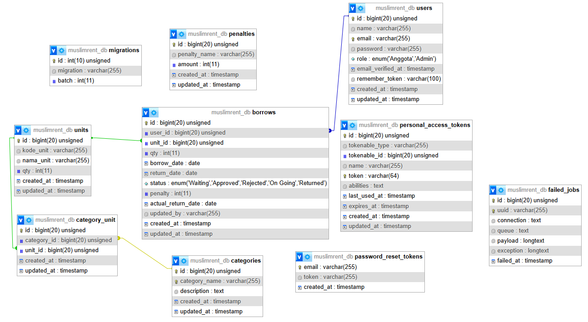

# MuslimRent
Website ini dibuat sebagai bagian dari pemenuhan pelatihan sertifikasi untuk mendapatkan sertifikasi BNSP Web Developer.

## Nama Kelompok
MuslimRent

## Anggota Kelompok
Nabiel Taqy

## Nama Produk
MuslimRent

## Deskripsi Proyek
MuslimRent adalah platform penyewaan alat salat yang dirancang untuk membantu pengguna yang membutuhkan alat salat berkualitas untuk sementara waktu. Layanan ini bertujuan untuk memudahkan penyewaan alat salat seperti sajadah, mukena, sarung, dan perlengkapan lainnya dengan proses yang mudah dan cepat.

## List Fitur
1. Admin
    - login
    - forgot password
    - edit profile
    - mengelola user (CRUD) beserta search
    - mengelola penalty (CRUD) beserta search
    - mengelola category (CRUD) beserta search
    - mengelola unit (CRUD) beserta search
    - mengelola transaksi peminjaman beserta search
    - dashboard utama (menampilkan jumlah transaksi, jumlah denda, jumlah transaksi waiting, recent transaksi)
    - melakukan print transaksi ke PDF
    - melakukan pengembalian peminjaman (transaksi)
    - secara otomatis menambahkan denda
    - merubah status peminjaman

2. Anggota
    - login
    - register
    - forgot password
    - edit profile
    - melakukan peminjaman max 2 peminjaman yang aktif
    - melihat history peminjaman
    - dashboard utama (menampilkan jumlah transaksi, jumlah denda, jumlah transaksi waiting, recent transaksi)
    - memantau status dari peminjaman
    - melakukan cancel peminjaman

## Link Video
https://drive.google.com/file/d/1PBnZohcZsISdF9sWhtCCP9e4u5_dWhtv/view?usp=sharing

## Schema Database MySQL

